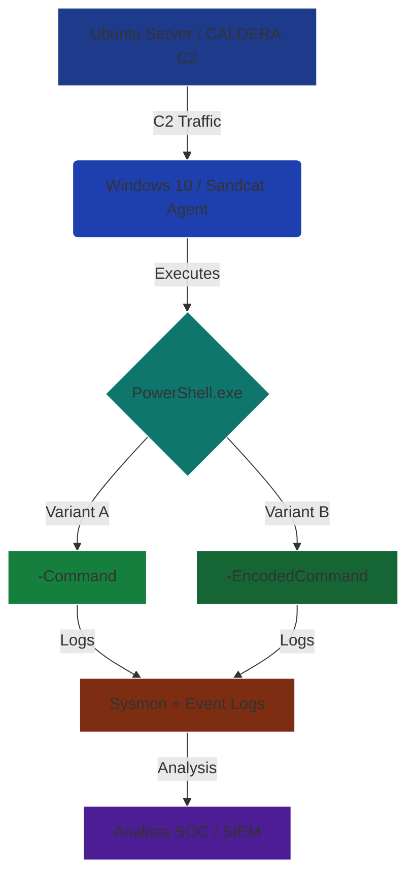

# Análisis de Técnica MITRE ATT&CK: T1059.001 (PowerShell)


Emulación y análisis defensivo de la técnica **T1059.001 – Command and Scripting Interpreter: PowerShell** utilizando **CALDERA** en un entorno Windows.

Referencia oficial: https://attack.mitre.org/techniques/T1059/001/

---

## 1. Objetivo del Ejercicio

Este laboratorio busca:

- Emular la técnica T1059.001 mediante:
  - `-Command` (texto claro)
  - `-EncodedCommand` (ofuscado en Base64)
- Evaluar la visibilidad generada por cada variante.
- Analizar telemetría crítica para detecciones: Sysmon, Event 4688 y Event 4104.
- Identificar oportunidades de detección, correlación y hardening.

El foco está en comparar:  
**CommandLine visible vs. CommandLine ofuscado**, destacando el rol del **Event ID 4104** en la deofuscación.

---

## 2. Entorno de Pruebas

**Infraestructura**

| Componente        | Detalle                     |
|-------------------|-----------------------------|
| Servidor C2       | CALDERA 5.x (Ubuntu Sever)  |
| Agente            | Sandcat (Go)                |
| Equipo Víctima    | Windows 10 Enterprise       |
| Antivirus         | Defender desactivado        |
| Red               | HTTP entre CALDERA y agente |

**Telemetría habilitada**

- **Sysmon (config SwiftOnSecurity)**  
  - Event ID 1: Process Creation    
  - Event ID 11: File Create

- **PowerShell Operational Logs**  
  - Event ID 4104: Script Block Logging  
  - Event ID 4103: Module Logging

- **Windows Security Log**  
  - Event ID 4688: Process Creation

---

## 3. Arquitectura del Ejercicio


---

## 4. Ejecución de la Técnica

Para este ejercicio se utilizó el framework **Atomic Test Harnesses** invocado a través de Caldera. Esto permite generar variaciones controladas de argumentos de línea de comandos.

### 4.1 Variante A: Ejecución en Texto Claro (`-Command`)
Se ejecutó un script complejo que carga módulos en memoria. Esta ejecución genera mucho ruido y múltiples artefactos (como la descarga del módulo).

**Comando Ejecutado:**
```powershell
powershell.exe -ExecutionPolicy Bypass -C "$RequiredModule = Get-Module -Name AtomicTestHarnesses -ListAvailable; if (-not $RequiredModule) {Install-Module -Name AtomicTestHarnesses -Scope CurrentUser -Force}; ; Out-ATHPowerShellCommandLineParameter -CommandLineSwitchType Hyphen -CommandParamVariation C -Execute -ErrorAction Stop"
```
### 4.2 Variante B: Ejecución Ofuscada (-EncodedCommand)
Para la segunda prueba, se codificó una instrucción similar en Base64 para ocultar la lógica del script.

**Comando Ejecutado:**
```powershell
powershell.exe -ExecutionPolicy Bypass -C "$RequiredModule = Get-Module -Name AtomicTestHarnesses -ListAvailable; if (-not $RequiredModule) {Install-Module -Name AtomicTestHarnesses -Scope CurrentUser -Force}; ; Out-ATHPowerShellCommandLineParameter -CommandLineSwitchType Hyphen -EncodedCommandParamVariation E -Execute -ErrorAction Stop" 
```
---
## 5. Fuentes de Recopilación y Análisis

*Nota: Esta sección detalla las fuentes de registro específicas utilizadas para reconstruir el ataque, explicando el valor defensivo de cada una según los estándares de la industria.*

### ID de evento de PowerShell Operativo 4104: Registro de Bloques de Scripts
Diseñado para capturar el contenido real del código que el motor de PowerShell procesa, este evento es la fuente de verdad definitiva contra la ofuscación. Mientras que la línea de comandos puede ocultar la intención mediante Base64 (`-EncodedCommand`), el registro de bloques de scripts captura el código **desofuscado** justo antes de la ejecución.
* **Observación del Laboratorio:** Independientemente de si se usó la variante en texto claro o la ofuscada, este evento reveló el script completo de `AtomicTestHarnesses`, exponiendo la lógica de descarga `Invoke-WebRequest` que permanecía oculta en otros logs.

### ID de evento de Sysmon 1 y Seguridad 4688: Creación de Procesos
La monitorización de la creación de procesos es fundamental para entender la jerarquía (quién ejecutó qué) y los argumentos de línea de comandos. Sysmon ID 1 enriquece esta data con hashes y detalles del proceso padre.
* **Observación del Laboratorio (Evasión):** Se identificó el uso de argumentos codificados (`-EncodedCommand`) para evadir firmas básicas de línea de comandos.
* **Observación del Laboratorio (Compilación):** Se detectó una cadena de ejecución anómala donde PowerShell invocó al compilador de C# (`csc.exe`). Esto indica una técnica de **"Compile After Delivery"**, donde el atacante compila herramientas ofensivas directamente en la memoria o disco de la víctima.

### ID de evento de Sysmon 11: Creación de Archivos
Los adversarios a menudo tocan el disco para establecer persistencia, compilar herramientas o verificar el entorno. Monitorear qué archivos crea `powershell.exe` en directorios temporales es una técnica de detección de alta fidelidad.
* **Observación A (Payloads Ofensivos):** Se detectó la escritura de librerías DLL con nombres aleatorios (ej: `gwvvvje0.dll`) en carpetas `Temp`. Esto correlaciona directamente con la actividad del compilador `csc.exe` observada, confirmando que el script "dejó caer" (dropped) binarios compilados.
* **Observación B (Sondeo de Políticas):** Se registraron archivos con el patrón `__PSScriptPolicyTest_*.ps1`. Estos son artefactos efímeros generados legítimamente por el motor de PowerShell para autoevaluar si existen restricciones de seguridad como **AppLocker** o **Constrained Language Mode (CLM)** activas antes de ejecutar el código.

### ID de evento de PowerShell Clásico 400: Ciclo de Vida del Motor
Este evento, presente en el registro clásico "Windows PowerShell", registra cuándo se inicia o detiene el motor de PowerShell. Es una fuente de datos crítica para detectar **Ataques de Degradación (Downgrade Attacks)**. Los adversarios a menudo intentan forzar el uso de PowerShell versión 2.0 para evitar las protecciones de seguridad modernas (como AMSI y el registro 4104).
* **Observación del Laboratorio:** El evento confirmó que la ejecución se realizó bajo una versión moderna del motor (EngineVersion 5.1), validando que los controles de seguridad estaban activos.

### IDs de evento 800 y 4103: Ejecución de Pipeline y Carga de Módulos
El evento 800 (Clásico) y el 4103 (Operativo) ofrecen visibilidad granular sobre qué partes específicas de un script se están ejecutando y qué módulos se están cargando en la sesión.
* **Observación del Laboratorio:** Se observó la carga del módulo `AtomicTestHarnesses` y la ejecución secuencial de sus funciones (`Out-ATHPowerShell...`). El evento 800 actuó como una capa de redundancia valiosa, capturando detalles de la ejecución del pipeline que complementan la visión del Script Block Logging.

---

## 6. Lógica de Detección (Sigma Rules)

Para este laboratorio, se desarrollaron dos reglas de detección clave. La primera se enfoca en el **mecanismo de evasión** (uso de comandos codificados) y la segunda se enfoca en la **acción real** (el contenido del script desofuscado), proporcionando una cobertura integral (Defense in Depth).

### 6.1 Detección de Ejecución Ofuscada (Mecanismo de Evasión)
Esta regla busca en la línea de comandos el parámetro que indica la codificación Base64, el primer paso en la evasión.

```yaml
title: PowerShell Encoded Command Execution
id: detect-ps-encoded-cmd
status: experimental
description: Detects PowerShell execution using the EncodedCommand parameter (including short variations like -Enc or -E). Alerts on the attempt to hide the command.
logsource:
    category: process_creation
    product: windows
detection:
    selection:
        Image|endswith:
            - '\powershell.exe'
            - '\pwsh.exe'
        CommandLine|contains:
            - ' -EncodedCommand '
            - ' -Enc '
            - ' -E '  
    condition: selection
level: medium
tags:
    - attack.execution
    - attack.t1059.001
    - attack.defense_evasion
    - attack.t1027
```
## 6.2 Detección de Payload Desofuscado (Alta Fidelidad)
Esta regla se enfoca en el contenido decodificado que se encuentra en el Evento 4104. Busca comandos altamente sospechosos (descarga, ejecución en memoria, uso del módulo del laboratorio) que confirman la acción maliciosa.

```yaml
title: High-Fidelity PowerShell Payload Detection (EID 4104)
id: detect-critical-ps-payload
status: experimental
description: Detects highly suspicious keywords (Downloaders, Obfuscation tools) inside the Script Block log (EID 4104). This rule is effective against T1059.001, payload delivery, and ignores CLI obfuscation.
logsource:
    product: windows
    service: powershell
    definition: 'Script Block Logging (EID 4104) is REQUIRED'
detection:
    selection:
        EventID: 4104
        ScriptBlockText|contains:
            - 'Invoke-WebRequest'
            - 'IEX'
            - 'DownloadString'
            - 'FromBase64String'
            - 'AtomicTestHarnesses' 
    condition: selection
level: critical
tags:
    - attack.execution
    - attack.t1059.001
    - attack.delivery
    - attack.impact
```
---
## 7. Mitigaciones y Hardening

Para reducir la superficie de ataque explotada en este laboratorio y neutralizar la técnica **T1059.001**, se recomiendan los siguientes controles de seguridad de alta fidelidad:

### 7.1. Controles de Ejecución y Motor de Scripting

Estos controles impiden la ejecución de código arbitrario y neutralizan las técnicas de evasión observadas (ofuscación y compilación).

* **Antimalware Scan Interface (AMSI):** Asegurar que AMSI esté activo y en buen estado es la primera defensa contra PowerShell ofuscado y fileless. AMSI inspecciona el código justo antes de ser ejecutado por el motor de scripting, permitiendo que el EDR/Antivirus vea el código real incluso antes de que se genere el Evento 4104.
* **Constrained Language Mode (CLM):** Restringir PowerShell a CLM. Esto bloquea la invocación de APIs de bajo nivel de .NET (`Add-Type`, etc.), neutralizando así la capacidad de compilar código C# al vuelo (`csc.exe`) y limitando la ofuscación compleja.
* **Application Control (AppLocker/WDAC):** Implementar políticas para restringir la ejecución de *utilidades duales* (`csc.exe`, `cvtres.exe`) cuando son lanzadas por procesos no confiables (como PowerShell o scripts en directorios temporales).

### 7.2. Logging y Visibilidad (Hardening de Telemetría)

El logging es la mitigación más efectiva contra la ofuscación. Estos controles aseguran que la telemetría de seguridad pueda capturar el contenido real del script.

* **Habilitar Script Block Logging (EID 4104):** Es la mitigación directa contra la ofuscación (`-EncodedCommand`), asegurando que todo el código sea visible. Debe habilitarse mediante GPO (`Turn on PowerShell Script Block Logging`).
* **Habilitar Module Logging (EID 4103):** Proporciona visibilidad sobre las funciones específicas de los módulos cargados (como `AtomicTestHarnesses`), útil para trazar qué comandos se hacen disponibles para el atacante.
* **Monitoreo de Logs Clásicos (EID 400):** Mantener el monitoreo del Evento 400 para detectar intentos de **Ataque de Degradación (Downgrade Attack)** a PowerShell v2.0, eludiendo los logs de AMSI y 4104.

### 7.3. Detección Comportamental

Aplicar controles para detectar las "huellas" que deja el ataque en el sistema de archivos.

* **Monitoreo de Carpetas Temporales:** Alerta sobre la creación de archivos binarios (`.dll`, `.exe`) o scripts en directorios de usuario o carpetas `Temp` por parte de procesos de *scripting* (Powershell, cscript), tal como se observó con la creación de la DLL maliciosa y los archivos de sondeo de políticas.

---
